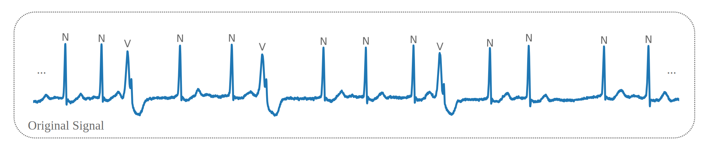
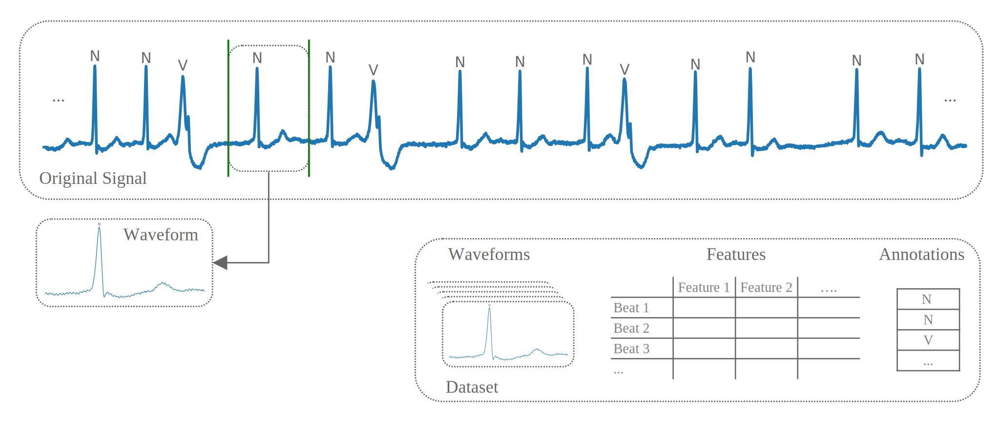
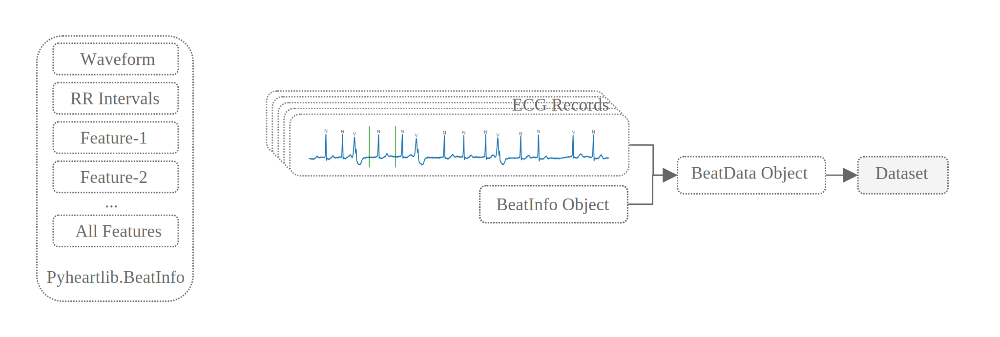
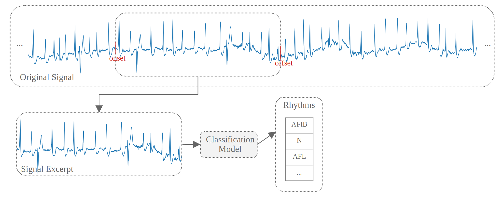

# Introduction

## What is pyheartlib?

`Pyheartlib` is a Python package for processing electrocardiogram (ECG) recordings. This software facilitates working with signals for tasks such as heartbeat detection, heartbeat classification, and arrhythmia classification. Utilizing it, researchers can focus on these tasks without the burden of designing data processing modules. The package transforms original data into processed signal excerpts and their computed features in order to be used for training various machine learning models including advanced deep learning models, which can be trained by taking advantage of Keras and Tensorflow libraries.

Recent advances in deep learning have made it possible to accomplish tasks previously unattainable through the implementation of conventional algorithms. The capabilities of conventional approaches for analyzing ECG signals are limited. Therefore, it is imperative to develop data-driven models capable of automatically identifying patterns from vast heterogeneous data. `Pyheartlib` supports this goal by providing data processing modules to assist researchers with the implementation of their own models for various tasks.

## Input Data

`Pyheartlib` utilizes the WFDB Python package[^1] to read annotated ECG records, therefore it supports the WFDB format. Recordings with different formats can be converted using the WFDB Python package. In the WFDB format, each record contains a set of files for the raw signal and its annotations. When the WFDB Python package reads a record, it provides the raw signal as an array, and its annotations and their locations on the raw signal as separate lists. For example, a signal with 500,000 samples may have around 2000 annotations for the R-peak labels (the heartbeat type placed at the peak of the R-wave) and the rhythm types. The figure presented below depicts a portion of a lengthy signal. Further details regarding the WFDB format can be obtained from [this link](https://github.com/MIT-LCP/wfdb-python). After reading a record, `pyheartlib` makes a data structure for the signal and its annotations. This data structure contains the heartbeat annotations (R-peak labels), rhythm annotations, annotation locations on the raw signal, and the raw signal itself.



## Class BeatData

For the heartbeat analysis task, the `BeatData` class can be used to make a dataset. This class processes the provided ECG records and generates a dataset comprising waveforms, computed features, and their corresponding labels. The figure below depicts the dataset. Researchers can further utilize this dataset for heartbeat classification tasks. It is possible to use various types of machine learning algorithms for this purpose.



In order to incorporate predefined or user-defined features into the dataset, it is necessary to provide a beatinfo object as an argument. The `BeatInfo` class is depicted in the figure provided below. The main parameters to specify when using the `BeatData` class include `base_path`, which holds all the raw and processed data; `win`, which determines the onset and offset of the excerpts around the R-peak; `records`, which are the names of the ECG records; `beatinfo_obj`, which is an instance of the `BeatInfo` class; and `file`, which is the name of the file to be saved. Based on the goal, it is possible to create inter- and intra-patient datasets. In the saved dataset, there is a two-dimensional array for the excerpts, a data frame for the features, and an array for the annotations. This dataset is particularly useful for training machine learning models for heartbeat classification.



As mentioned, in order to incorporate predefined or user-defined features into the dataset, it is necessary to provide a beatinfo object as an argument. `BeatInfo` processes the data for every heartbeat to compute its features. In order to obtain a list of all available features in a beatinfo object, the `available_features()` method can be used. To add new user-defined features to the object, the `add_features()` method can be used. In order to select the desired features, the `select_features()` method can be utilized. The `bwaveform` attribute is the segmented beat waveform and the `rri` attribute contains RR-intervals.

:::{admonition} class BeatInfo
:class: hint
:name: directive-bif

- `bwaveform`:  Segmented beat waveform.
- `rri`:  List of RR-intervals.
- `beat_loc`:  Index of beat in the R-peaks locations list.
- `features`: Dictionary containing computed features.
---
```{eval-rst}
- :meth:`available_features() <pyheartlib.beat_info.BeatInfo.available_features>` : Returns available features that can be computed.
- :meth:`add_features() <pyheartlib.beat_info.BeatInfo.add_features>` : Adds new features.
- :meth:`select_features() <pyheartlib.beat_info.BeatInfo.select_features>` : Select desired features for computation.
```

```{eval-rst}
See also:
:py:obj:`pyheartlib.beat_info.BeatInfo`
```
:::

:::{admonition} class BeatData
:class: hint
:name: directive-bdt

- `base_path` : Path of the main directory for storing the original and processed data.
- `win` : [Onset, Offset] of signal excerpts around the R-peaks, by default [60, 120].
- `num_pre_rr` : Number of preceding R-peak locations to be included for each beat,default 10.
- `num_post_rr` : Number of subsequent R-peak locations to be included,default 10.
- `remove_bl` : If True, the baseline wander is removed from the original signals prior to extracting excerpts.
- `lowpass` : Whether or not to apply low-pass filter to the original signals.
- `cutoff` : Parameter of the low pass-filter.
- `order` : Parameter of the low pass-filter.
- `progress_bar` : Whether to display a progress bar.
- `processors` : Ordered list of functions' names for preprocessing the raw signals. Each function takes a one-dimensional NumPy array as its input and returns an array of the same length.
---
```{eval-rst}    It is zero-padded on the right side, by default 150

:meth:`save_dataset_inter() <pyheartlib.data_beat.BeatData.save_dataset_inter>` :
```
- `records`: List of records IDs.
- `beatinfo_obj`:  Instance of BeatInfo.
- `file`:  Name of the file that will be saved.

```{eval-rst}
See also:
:py:obj:`pyheartlib.data_beat.BeatData`
```
:::

:::{admonition} Example
:class: attention
{doc}`Heartbeat dataset <examples/heartbeat>`
:::

---
## Class RhythmData

For the arrhythmia classification, the `RhythmData` class can be utilized to create the required dataset. This class produces a dataset that contains all the information about the records, such as signals and their annotations, as well as metadata about the sample excerpts. For each excerpt, this metadata is provided as a list, containing the record ID, onset and offset of the excerpt on the raw signal, and the excerpt annotation. The excerpt onset and offset are computed by a sliding window, whose amount of movement can be specified using the `stride` parameter. The length of the window (excerpt length) can be specified by using the `win_size` parameter. The metadata can be utilized to extract the excerpts in batches by utilizing the `ECGSequence` class. The use of metadata instead of excerpts has the advantage of reducing the RAM requirement, especially when numerous excerpts are required from the raw signals. By using metadata about the excerpts, they are extracted in batches whenever they are needed. This method is even more beneficial when the goal is to use each except only once, and thus there is no need to keep it in memory. Instead, nearby excerpts with the same annotation can be extracted from the signal. It is possible to achieve this by defining a smaller stride value when creating a dataset using the `RhythmData` class.

:::{admonition} class RhythmData
:class: hint
:name: directive-rdt

- `base_path` : Path of the main directory for storing the original and processed data.
- `remove_bl` : If True, the baseline wander is removed from the original signals prior to extracting excerpts.
- `lowpass` : Whether or not to apply low-pass filter to the original signals.
- `cutoff` : Parameter of the low pass-filter.
- `order` : Parameter of the low pass-filter.
- `progress_bar` : Whether to display a progress bar.
- `processors` : Ordered list of functions' names for preprocessing the raw signals. Each function takes a one-dimensional NumPy array as its input and returns an array of the same length.
---
```{eval-rst}
:meth:`save_dataset() <pyheartlib.data.DataSeq.save_dataset>` :
```
- `rec_list`:  List of records IDs.
- `file_name`:  Name of the file that will be saved.
- `win_size`:  Sliding window length (excerpt length).
- `stride`:  Stride of the sliding window.

```{eval-rst}
See also:
:py:obj:`pyheartlib.data_rhythm.RhythmData`
```
:::

Once a dataset is ready, it can be utilized in the `ECGSequence` class to generate samples of data in batches. `ECGSequence` uses the Sequence class provided in Tensorflow library[^2] as its base class. The output batches contain annotations, waveforms, or their features, RR-intervals, and RR-interval features.


:::{admonition} class ECGSequence
:class: hint
:name: directive-rsq

- `data` : A list containing a dictionary for each record: [rec1,rec2,….].
- `samples_info` : A nested list of metadata for excerpts.
- `class_labels` : Classes as a list for converting the output annotations to integers such as: ["(N", "(VT"] => [0,1].
- `batch_size` : Number of samples in each batch.
- `raw` : Whether to return the waveform or the computed features.
- `interval` : Interval for sub-segmenting the signal for waveform feature computation.
- `shuffle` : If True, after each epoch the samples are shuffled.
- `rri_output` : Whether to return RR-intervals and their features.
- `rri_length` : Length of the output RR-intervals list. It is zero-padded on the right side.

```{eval-rst}
See also:
:py:obj:`pyheartlib.data_rhythm.ECGSequence`
```
:::

:::{admonition} Example
:class: attention

{doc}`Arrhythmia dataset <examples/arrhythmia>`
:::

The figure below depicts an excerpt, its onset, and offset on the original signal.



---
## Class RpeakData

Similar to the `RhythmData` class, the `RpeakData` class produces a dataset from given records that contains all the information about the records, such as signals and their annotations, as well as metadata about the sample excerpts. This metadata is provided for each excerpt as a list, containing the record ID, onset and offset of the excerpt on the raw signal, and the annotation. The onset and offset of the excerpt are calculated by a sliding window, whose amount of movement can be set using the `stride` parameter. The length of the window (excerpt length) can be specified by using the `win_size` parameter. Similar to the `RhythmData` class, utilizing metadata to store the location of signal excerpts is a memory-efficient approach. However, unlike working with rhythm data, where each excerpt has a single annotation, working with R-peak labels requires the annotation to have multiple labels for each excerpt. This is because of the presence of multiple heartbeats in a single excerpt. This issue is solved by making a list of labels for each excerpt instead of just one label as an annotation. Once a dataset is ready, it can be utilized in the `ECGSequence` class to generate samples of data in batches. The generated batches contain waveforms, or their features, and the annotations. Annotations are provided as a list, with each element associated with a sub-segment of the excerpt. Therefore, a sub-segment that contains an R-peak labeled "N" will have this label in the annotation list generated by the `ECGSequence`. The `interval` parameter determines the length of each sub-segment within an excerpt. It controls the degree of granularity for labels in the output annotation list and the number of sub-segments. To get computed features instead of waveforms in the generated batches, the `raw` parameter should be set to False.


:::{admonition} class RpeakData
:class: hint
:name: directive-rpd

- `base_path` : Path of the main directory for storing the original and processed data.
- `remove_bl` : If True, the baseline wander is removed from the original signals prior to extracting excerpts.
- `lowpass` : Whether or not to apply low-pass filter to the original signals.
- `cutoff` : Parameter of the low pass-filter.
- `order` : Parameter of the low pass-filter.
- `progress_bar` : Whether to display a progress bar.
- `processors` : Ordered list of functions' names for preprocessing the raw signals. Each function takes a one-dimensional NumPy array as its input and returns an array of the same length.
---
```{eval-rst}
:meth:`save_dataset() <pyheartlib.data.DataSeq.save_dataset>` :
```
- `rec_list`:  List of records IDs.
- `file_name`:  Name of the file that will be saved.
- `win_size`:  Sliding window length (excerpt length).
- `stride`:  Stride of the sliding window.

```{eval-rst}
See also:
:py:obj:`pyheartlib.data_rpeak.RpeakData`
```
:::

Once a dataset is ready, it can be utilized in the `ECGSequence` class to generate samples of data in batches. `ECGSequence` uses the Sequence class provided in Tensorflow library[^2] as its base class. The output batches contain annotations as well as waveforms or their computed features.


:::{admonition} class ECGSequence
:class: hint
:name: directive-rps

- `data` : A list containing a dictionary for each record: [rec1,rec2,….].
- `samples_info` : A nested list of metadata for excerpts.
- `class_labels` : Classes as a list for converting the output annotations to integers such as: [0, "N", "V"] => [0,1,2].
- `batch_size` : Number of samples in each batch.
- `binary` : If True, any non-zero label will be converted to 1 in the output annotation list.
- `raw` : Whether to return the waveform or the computed features.
- `interval` : Sub-segmenting interval for feature computations and label assignments. Controls the degree of granularity for labels in the output annotation list and the number of sub-segments.
- `shuffle` : If True, after each epoch the samples are shuffled.

```{eval-rst}
See also:
:py:obj:`pyheartlib.data_rpeak.ECGSequence`
```
:::

:::{admonition} Examples
:class: attention

- {doc}`R-peak dataset <examples/rpeak>`
- {doc}`R-peak detection <examples/rpeak_detection>`
:::


[^1]: [WFDB Python package](https://github.com/MIT-LCP/wfdb-python)
[^2]: [www.tensorflow.org](https://www.tensorflow.org/)
