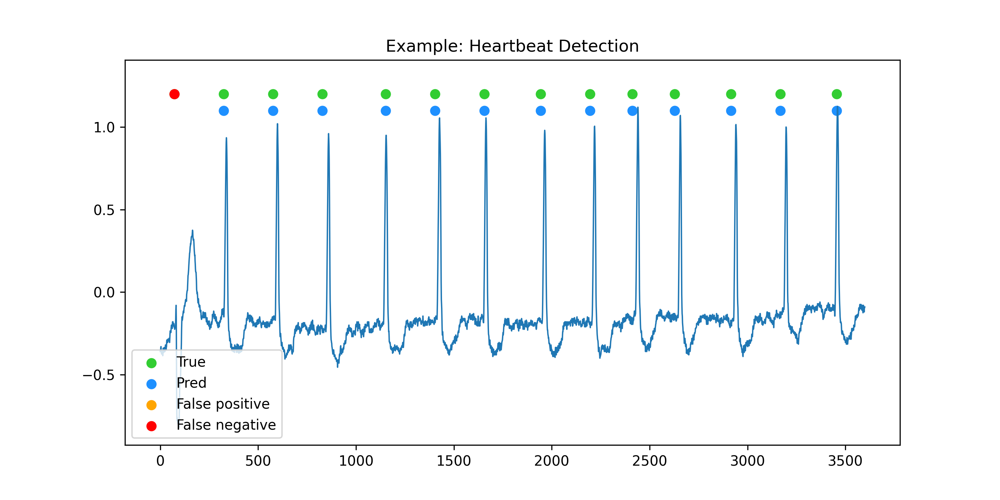

# Example: R-peak Detection

This example contains the code for training a deep learning model for the R-peak detection task. In this example, the electrocardiogram signals are segmented into ten-second ecxerpts. Each excerpt is associated with an annotation list of length 600, containing zeros and ones. A subsegment of an excerpt that contains an R-peak corresponds to 1 in the annotation list. To achieve this goal, the `RpeakData` class is used to create the required train, validation, and test datasets.  Each dataset consists of signals and annotations, as well as metadata about the excerpts. The metadata for each excerpt includes the record ID, the onset and offset of the excerpt on the raw signal, and the annotation.

[rpeak_detection.ipynb](rpeak_detection.ipynb).

