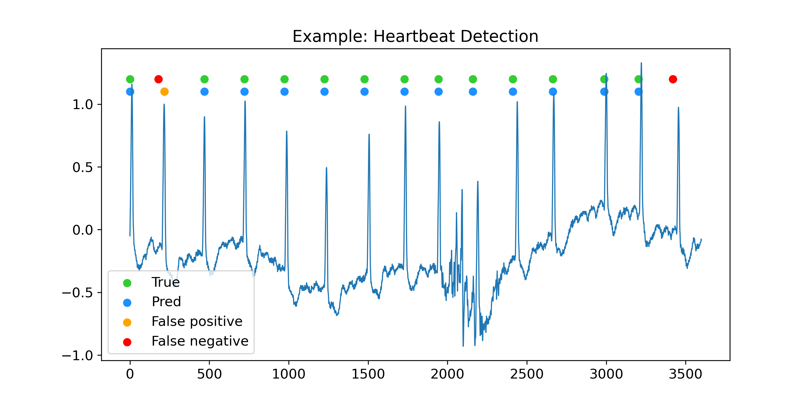

==============
Beat Detection
==============

This directory contains the code for training a deep learning model for the heartbeat detection task.
As the task is not complex, it can be trained with high accuracy on few samples.

The ECG signals are segmented into 10 seconds ecxerpts.
Each excerpt has a label of length 100 containing zeros and ones.
For each 100ms segment the item is one if it is a peak, otherwise it is zero.

The following steps prepares data and trains the example model.

Data preparation
================

.. literalinclude:: data_preparation.py
  :language: python

Training
========

.. literalinclude:: train.py
  :language: python

Inference
=========

.. literalinclude:: inference.py
  :language: python

Results
=======

.. literalinclude:: result.txt

