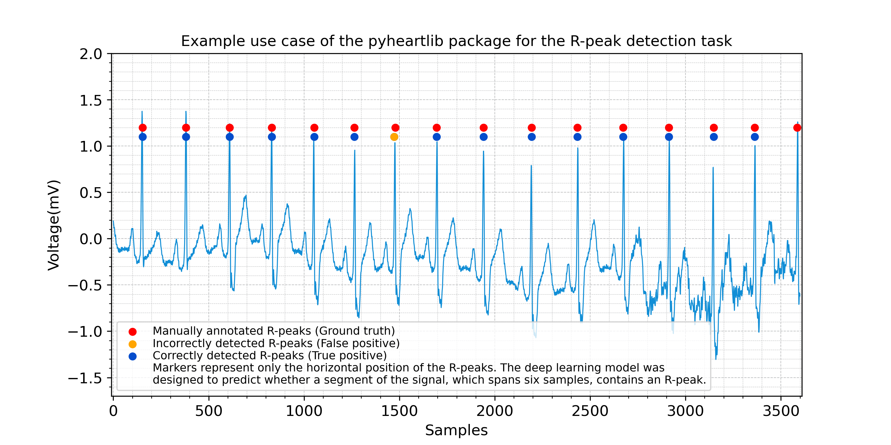

# Summary

Electrocardiogram (ECG) signals represent the electrical activity of the heart as a graph of voltage versus time. These signals have significant importance in healthcare and contain valuable information. Therefore, they can be analyzed for the diagnosis and early detection of various cardiac conditions.
`Pyheartlib` is a Python package for processing electrocardiogram recordings. This software facilitates working with signals for tasks such as heartbeat detection, heartbeat classification, and arrhythmia classification. Utilizing it, researchers can focus on these tasks without the burden of designing data processing modules. The package transforms original data into processed signal excerpts and their computed features in order to be utilized for training various machine learning models including advanced deep learning models which can be trained by taking advantage of Keras [@chollet2015keras] and Tensorflow [@tensorflow2015] libraries.

# Statement of need

A popular software for working with electrocardiogram recordings is the WFDB Python package, which has the ability to read and write recordings and perform some basic signal processing operations [@moody2001impact;@goldberger2000physiobank;@wfdb-python;@wfdb-software-package].  NeuroKit is another Python package with some functionalities such as denoising, delineation, and plotting [@Makowski_NeuroKit2_A_Python_2021]. These packages don't have the ability to prepare electrocardiogram recordings for training machine-learning models for various tasks. `Pyheartlib` addresses this issue by providing researchers with the necessary data processing modules. It comprises several dedicated classes for different use cases.
For the heartbeat classification task, which typically requires segmented and annotated heartbeat waveforms, the software preprocesses the input data and delivers a dataset comprising waveforms and features. Features can be computed from waveform and RR-intervals.
For the classification of signal excerpts, e.g., arrhythmia classification, the software is designed to store metadata about the excerpts in order to reduce memory usage significantly, especially in situations that each excerpt is being used only once during model training. By adjusting the parameters appropriately, the package provides a substantial quantity of data samples for training deep learning models. Moreover, it is feasible to incorporate RR-intervals in addition to waveforms and their computed features.
Another use case is when each excerpt has to be divided into smaller sub-segments each with a specific label, e.g., r-peak detection. The package delivers data samples by storing metadata about the excerpts and providing an annotation for each excerpt as a list of labels.
The package is easy to use and its documentation contains examples for different use cases. An example deep learning model is designed using the Keras library for the heartbeat detection task. Because this task is less complex compared to the heartbeat and arrhythmia classification tasks, it can be trained with high accuracy using available public datasets. 

{ width=80% }

This package utilizes the WFDB Python package to read data, therefore it supports the WFDB format. For recordings that are not in the WFDB format, the WFDB Python package can be utilized for conversion [@moody2001impact;@goldberger2000physiobank;@wfdb-python;@wfdb-software-package].

# References