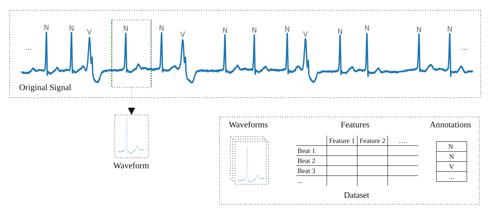
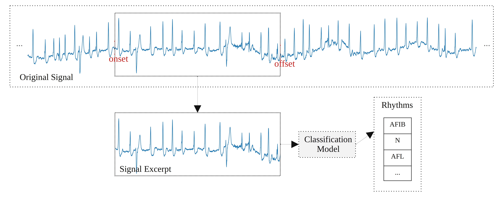

# Summary

Electrocardiogram (ECG) signals represent the electrical activity of the heart as a graph of voltage versus time. These signals have significant importance in healthcare and contain valuable information. Therefore, they can be analyzed for the diagnosis of various diseases.

`Pyheartlib` is a Python package for processing electrocardiogram recordings. This software facilitates working with signals for tasks such as heartbeat detection, heartbeat classification, and arrhythmia classification. Utilizing it, researchers can focus on these tasks without the burden of designing data processing modules. The package transforms original data into processed signal excerpts and their computed features in order to be used for training various machine learning models including advanced deep learning models, which can be trained by taking advantage of Keras [@chollet2015keras] and Tensorflow [@tensorflow2015] libraries.

# Statement of need

Recent advances in deep learning have made it possible to accomplish tasks previously unattainable through the implementation of conventional algorithms. The capabilities of conventional approaches for analyzing ECG signals are limited. Therefore, it is imperative to develop data-driven models capable of automatically identifying patterns from vast heterogeneous data. `Pyheartlib` supports this goal and, unlike popular packages such as NeuroKit2 [@NeuroKit2_2021], does not implement pre-defined algorithms. It instead provides data processing modules to assist researchers with the implementation of their own models for various tasks. For example, SleepECG [@SleepECG_2023] and Neurokit2 [@NeuroKit2_2021] have implemented several conventional methods, such as the Pan–Tompkins [@PanTompkins1985] and Hamilton [@Hamilton2002] algorithms, for the R-peak detection task. However, the same task can be accomplished through deep learning. Various models can be trained by utilizing the readily available data processing modules in `Pyheartlib`. An example model is provided with this package that performs this task. `Pyheartlib` comprises several dedicated classes for different use cases.

For the heartbeat classification task, which typically requires segmented and annotated heartbeat waveforms, the software processes the input data and delivers datasets comprising waveforms and features. Features can be computed from waveform and RR-intervals (see \autoref{fig:fig1}).

{ width=98% }

For the classification of signal excerpts, e.g., arrhythmia classification (\autoref{fig:fig2}), the software is designed to store metadata about the excerpts in order to reduce memory usage significantly, especially in situations where each excerpt is being used only once during model training. By adjusting the parameters appropriately, the package provides a substantial quantity of data samples for training deep learning models. Moreover, it is feasible to incorporate RR-intervals in addition to waveforms and their computed features.

{ width=98% }

Another use case is when each excerpt has to be divided into smaller sub-segments each with a specific label, e.g., R-peak detection. The package delivers data samples by storing metadata about the excerpts and providing lists of labels as annotations for the excerpts.

`Pyheartlib` is easy to use and its documentation contains examples for different use cases. \autoref{fig:fig3} illustrates an example outcome of a deep learning model that was trained with the help of `Pyheartlib` and Keras [@chollet2015keras] to detect R-peaks.

{ width=98% }

This package utilizes the WFDB Python package to read data, therefore it supports the WFDB format. Recordings with different formats can be converted using the WFDB Python package [@moody2001impact;@goldberger2000physiobank;@wfdb-python;@wfdb-software-package].

# References
